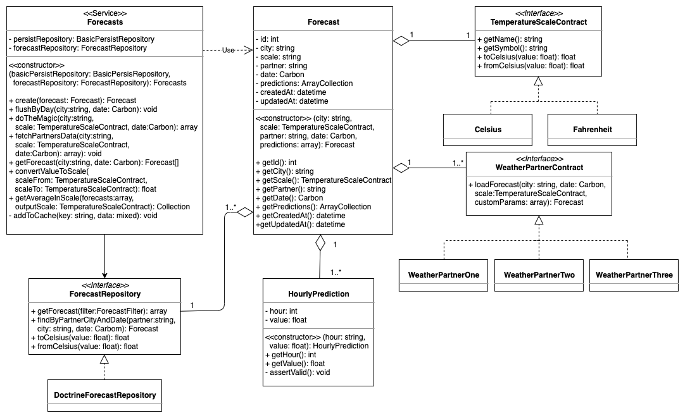
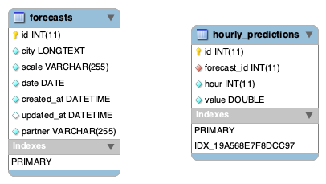

# Weather Predictor Application

This application provides a service for get the forecast from different weather partners and calculate a magic forecast from the partners data.

The application is developed using the Laravel Framework and usign docker-compose for easily create a development environment.

## Class Diagram


## ER Diagram


## Installation Instructions

You need a environment with the requirements for use the Laravel Framework v5.8 and also needs

The requirements are the following:

* PHP >= 7.1.3
* BCMath PHP Extension
* Ctype PHP Extension
* JSON PHP Extension
* Mbstring PHP Extension
* OpenSSL PHP Extension
* PDO PHP Extension
* Tokenizer PHP Extension
* XML PHP Extension
* Composer dependency manager


The next step is cloning the repository to your local from the remote repository:

```sh 
$ git clone https://github.com/dneira/weather-predictor.git
``` 

Install the composer dependencies:

```sh 
$ composer install
``` 

Now you need to create the `env` file and modify this file with your own credentials and configuration:

```sh 
$ cp .env.example .env
``` 

We need to change some permissions for the storage folder:

```sh 
$ chmod 775 storage/ -R
``` 


Let's create the database schema using the doctrine schema update command with `artisan`

```sh 
$ php artisan doctrine:schema:update
``` 

Now we are ready to use our application.

## Docker

We have a  ``docker-compose`` file for use the application easily with docker containers.

Just running the following command the docker containers will be downloaded, created and started for use our application with this service.

We need to change some permissions for the storage folder:

```sh 
$ docker-compose up -d
``` 

Please check the ```docker-compose.yml``` file to review the service containers and configuration.

## WeatherPrediction API

We have and enpoint that receive 3 parameters ```city``` ``scale`` and ``date``. The date is optional if you dont pass the parameter to the API the date will be the current date.

Examples: 

* `/api/predictor/{city}/{scale}/` predicts the forecast of today in the given temperature scale.
* `/api/predictor/{city}/{scale}/{date}` predicts the forecast of the given date in the given temperature scale.

## API Parameters

| Parameter | Type | Example | Notes |
| --------- | ---- | ------- | ----- |
| ``city``  | string | *Amsterdam* | Case Insensitive|
| ``scale`  | string | *Celsius* | Case Insensitive, Examples: ``celsius``, ``fahrenheit``|
| ``day``  | string, YYYY-mm-dd | 2020-01-31 | Optional. The predictor only allow dates from today to 10 days (Configurable, review ``config/predictor.php``) |

## API Response

The API returns the data in the JSON format because is the most human readable format and common in the API development.

Response Example:

Example response:
```
{
    "statusCode": 200,
    "day": "2018-01-12",
    "outputScale": "Farenheit",
    "outputScaleSymbol": "°F",
    "city": "amsterdam",
    "forecast": [
        {
            "hour": 0,
            "value": 37.666666666666664
        },
        {
            "hour": 1,
            "value": 38
        },
        {
            "hour": 2,
            "value": 36.86666666666667
        },
        {
            "hour": 3,
            "value": 36
        },
        {
            "hour": 4,
            "value": 37.6
        },
        {
            "hour": 5,
            "value": 34.666666666666664
        },
        {
            "hour": 6,
            "value": 47
        },
        {
            "hour": 7,
            "value": 28.666666666666668
        },
        {
            "hour": 8,
            "value": 30.866666666666664
        },
        {
            "hour": 9,
            "value": 31.733333333333334
        },
        {
            "hour": 10,
            "value": 32.93333333333333
        }
    ]
}
```

## Credits
Made with coffee and love by [Didier Neira](http://github.com/dneira)


